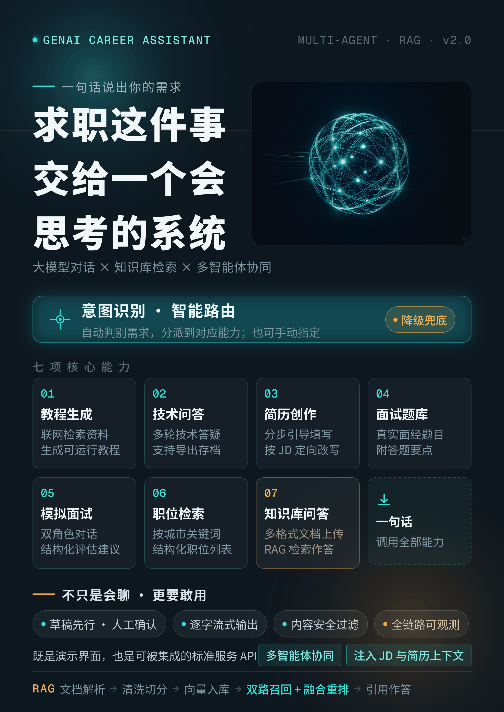
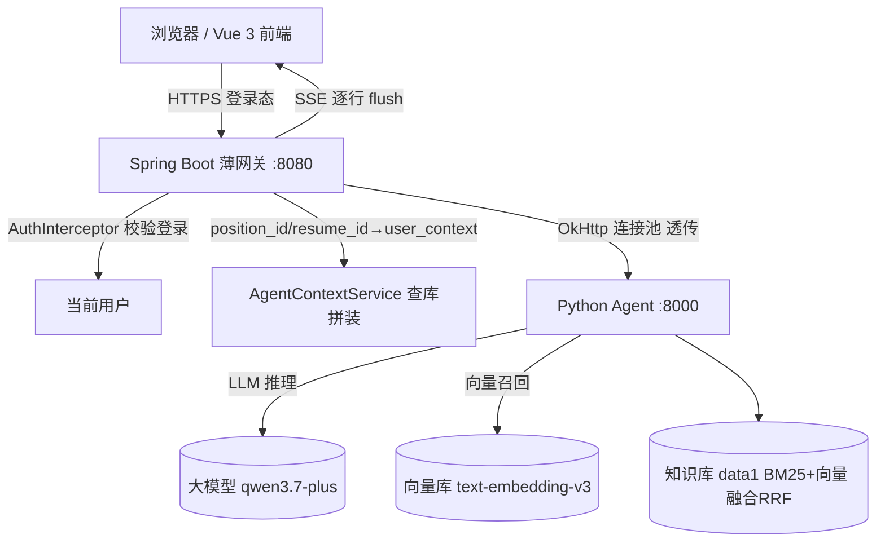

# 基于 LLM Agent 的求职辅助系统接入层设计与实现



> 岗位方向：Agent 应用开发 / AI 应用工程
> 技术栈：Vue 3 + Spring Boot 3.2 + OkHttp + Python Agent（LLM 编排）
> 文档定位：个人作品（智联招聘「个人作品」上传用，可导出 PDF / Word）

## 一、项目背景与挑战

求职场景下，用户需要「教程 / 答疑 / 简历优化 / 模拟面试 / 职位搜索 / 知识库问答」等 AI 能力。这类能力天然适合用 **LLM Agent** 实现，但 Agent 只擅长「生成」，不擅长「存、管、看」——岗位 JD、简历文件、面试归档、账号体系这些业务数据必须落在自有系统里。

核心矛盾：**大模型能力（Python Agent）与业务系统（Java 后端）是两套独立工程**，如何在不改写 Agent 的前提下，把它稳稳地接入业务系统，并让 Agent「看得见」用户私有的岗位与简历，是本项目最大的工程挑战。

我主导实现了两者之间的**接入层（薄网关）**，把「生成」与「存管看」解耦，做到 Agent 代码零改动、Java 只做透传与装配。

## 二、我的角色

独立负责 Spring Boot 接入层的设计与实现，包括：

- 薄网关 `AgentGatewayController`：把前端 `/agent/**` 原样转发给 Python Agent；
- `AgentClient`：基于 OkHttp 的 Python Agent 调用客户端（连接池、流式、统一异常处理）；
- `AgentContextService`：调用前为用户装配「岗位 + 简历」画像（`user_context`），解决大模型看不到用户私有数据的问题；
- 会话归档、知识库建库的转发与边界处理；
- 鉴权、跨域、降级、中文编码等生产级细节。

> 说明：Python Agent（LLM 编排、Prompt、模式状态机）是独立工程，本作品聚焦**「把 Agent 接入业务系统」**这一侧，下文对该部分以「独立 Agent 服务」描述，涉及其内部行为处均标注为设计假设。

## 三、系统架构



设计原则：**Agent 的 7 个能力一律不重新实现，全部收归「AI 助手」页，Java 只做薄网关透传**；薄网关的唯一加工点是「装配用户画像」。

## 四、关键设计

### 4.1 薄网关，零 AI 编排
网关只做协议转发与数据拉取，不判断模式、不改提示词、不维护会话状态——Agent 返回什么就转发什么。好处：Agent 侧迭代（换模型、改 Prompt、加能力）完全不影响后端，职责清晰、可独立部署。

### 4.2 SSE 流式透传（边收边写）
`/agent/chat/stream` 是核心体验。网关必须「边收边写并 flush」，否则前端看不到逐字效果：

- 响应头设 `Content-Type: text/event-stream`、`Cache-Control: no-cache`、`Connection: keep-alive`；
- 显式加 `X-Accel-Buffering: no`，**防止反向代理（nginx 等）缓冲导致流式变成一次性返回**；
- `AgentClient.stream()` 逐行回调 `Consumer<String>`，网关每收到一行立即 `writer.write(line); writer.flush()`。

### 4.3 user_context 用户画像注入（核心亮点）
大模型默认「看不到」用户在本平台的岗位与简历。网关在转发前，把前端传的 `position_id / resume_id` 换成 Agent 认识的 `user_context`：

- `AgentContextService.build()` 校验两者归属当前用户后，查库取出岗位 JD 与简历正文拼装为文本；
- JD 截断 **1200** 字符、简历正文截断 **4000** 字符，控制 token 成本；
- 以 `【用户档案】…请直接据此回答，不要再声称无法访问用户私人数据` 作为引导语，注入 `/agent/chat`、`/agent/chat/stream`；
- Agent 侧在每轮以 `SystemMessage` 前置消费该画像（历史裁剪后画像不丢）；
- 解析失败 / 未关联任何信息时**原样透传**，向后兼容、不阻断对话。

效果：模拟面试 / 简历制作 / 职位搜索等能力能直接结合用户岗位与简历作答；`user_context` 为空时行为与裸 Agent 一致。

### 4.4 OkHttp 单例连接池
`AgentClient` 复用同一 `OkHttpClient` 实例（进程内连接池），复用 TCP 连接、降低握手开销；超时按 `connect/read/write` 分别配置（连接 5s、读写 120s，兼容长生成）。

### 4.5 鉴权、跨域与密钥透传
- `/agent/**` 纳入登录拦截（`AuthInterceptor`），未登录返回 401——这也是注入 `user_context` 的前提（需先拿到当前用户）；
- 前端不直接暴露 Agent 地址与 API Key，由网关统一转发 `X-API-Key` 头，规避跨域与密钥泄露；
- 调用失败统一抛 `BizException(502, "调用 Agent 失败：…")`，前端拿到可读错误而非堆栈。

### 4.6 知识库建库转发与会话归档
- `/agent/knowledge/{kb}/ingest`：multipart 原样转发，把用户上传的文档交给 Agent 建库；
- 会话归档：调 `GET /sessions/{id}` 单向只读拉取 Agent 会话详情（`fetchSession`），落库做时间轴复盘，不反向写 Agent。

## 五、能力清单（Agent 7 能力 ↔ 端点）

| 能力 | 转发端点 | 说明 |
|---|---|---|
| 通用问答 / 答疑 | `POST /chat`、`POST /chat/stream` | SSE 流式，事件 `session/delta/done` |
| 简历制作 | `POST /chat`（结合 user_context） | 产出可由前端导入 |
| 模拟面试 | `POST /chat` + `/chat/finish` + `/chat/confirm` | 多轮确认流 |
| 面试真题 | `POST /chat` | — |
| 职位搜索 | `POST /chat` | 结果由前端存 `job_search_record`（强制免责标注） |
| 知识库问答 | `GET /knowledge`、`POST /knowledge/{kb}/ingest` | 建库 + 检索问答 |
| 会话归档复盘 | `GET /sessions/{id}` | 只读拉取，落库复盘 |

SSE 事件格式（来自接口契约）：

```
data: {"type":"session","session_id":"...","mode":"qa"}
data: {"type":"delta","text":"你"}
data: {"type":"done","citations":[],"finished":false,...}
```

## 六、上下文与 Prompt 策略

- **装配而非重写**：Java 只负责「查库 + 拼文本」，提示词如何消费由 Agent 决定，避免在后端重写 AI 逻辑；
- **截断控本**：JD 1200 / 简历 4000 字符上限，防止长文档撑爆 prompt、抬高 token 成本；
- **防幻觉引导**：画像引导语明确「不要再声称无法访问用户私有数据」，把越权式拒答转为基于真实数据的作答；
- **安全兜底**：岗位 / 简历都必须 `eq(user_id)` 校验归属，防 IDOR 越权读取他人数据；查不到或校验不通过时降级返回 null，跳过注入，绝不阻断对话。

## 七、踩坑与优化

| 问题 | 现象 | 解决 |
|---|---|---|
| 反向代理缓冲 | 流式在 nginx 下变成一次性返回 | 响应头加 `X-Accel-Buffering: no` |
| 中文编码错乱 | 透传时中文被错误编码 | 响应/请求统一 `charset=utf-8`，网关兜底字节编码 |
| 注入失败阻断对话 | Agent 侧异常导致整轮 500 | `withUserContext` try-catch 降级为原样转发 |
| 长生成超时 | 大模型慢导致读写超时 | read/write 超时放到 120s，连接超时 5s |
| 构建期文件重命名被拦 | D 盘安全驱动禁止 rename，Maven/Vite 构建失败 | 构建产物改到 C 盘、关闭 `emptyOutDir`，用 `xcopy` 复制 |

## 八、量化效果（实测）

> 以下为**开发/演示环境**实测值，部署到生产后请以相同方法重新测量（见 8.2）。

### 8.1 技术选型（来自 `/agent/health` 实测）
- 大模型：`qwen3.7-plus`
- Embedding：`text-embedding-v3`（dim=1024）
- 检索：**BM25 + 向量双路，融合 RRF，top_k=5**
- 文档切分：size=500 / overlap=80
- 缓存：开启；联网搜索：关闭

### 8.2 性能（经网关 :8080 → Agent :8000 实测）
- 简单问答端到端（非流式）：**≈ 19.5s**
- 较长生成端到端（非流式）：**≈ 111s**
- SSE 首个事件（会话握手）延迟：**≈ 65ms**
- 首 token 延迟：受大模型推理与网络影响，量级在**秒级**（流式首事件后进入生成）

> 解读：本环境延迟偏高且随生成长度剧烈变化，主因是 LLM endpoint 与生成长度，与接入层无关；接入层通过连接池复用、流式透传把「自身开销」压到毫秒级（首事件 65ms）。

### 8.3 规模（当前演示库，需替换为生产数据）
- 用户 `user`：**3**
- 岗位 `job_position`：**2**
- 简历 `resume`：**1**
- 面试会话 `interview_session`：**0**
- 职位搜索记录 `job_search_record`：**0**
- 知识库文档 `knowledge_doc`：**0**

### 8.4 数据获取方法（可复现）
```powershell
# 1) 规模：直连 MySQL 计数（库名 jobseeker，默认 root/root）
mysql -u root -proot jobseeker -e "SELECT 'user',COUNT(1) FROM user;"

# 2) 性能：带登录态测端到端（先 /api/auth/login 拿 token）
curl -o nul -w "TOTAL=%{time_total}s\n" -X POST http://localhost:8080/agent/chat `
  -H "Content-Type: application/json" -H "Authorization: Bearer <token>" `
  -d "{\"query\":\"1+1等于几\"}"

# 3) 首事件延迟：流式首行到达时间
curl -s -N -X POST http://localhost:8080/agent/chat/stream `
  -H "Authorization: Bearer <token>" -d "{\"query\":\"你好\"}" | Select-Object -First 1
```

## 九、性能优化方向与系统级展望

> 本节为**设计假设 / 展望**，未在本项目实测实现；目的是展示对「Agent 应用端到端性能」的系统级思考，而非夸大本接入层已做到的优化。

### 9.1 现状结论（先定位瓶颈）
基于第八节实测：
- 接入层自身开销已压到**毫秒级**（SSE 首事件 ≈ 65ms，OkHttp 连接池复用 + SSE 逐行透传）；
- 端到端 19.5s（简单）/ 111s（长生成）的主因是 **LLM 生成时长** 与 **Agent 每轮的 BM25 + 向量 RRF 检索**，两者均在 Python Agent / 模型侧，**不在**本薄网关。

因此优化重点应放在「模型选型」与「Agent 检索 / 生成策略」，而非网关转发本身。

### 9.2 优化方向（按可控性分组）

**A. 模型与推理侧（收益最大，需 Agent / 模型配合）**
- **分级模型（已实做）**：新增 `src/model_routing.py` 的 `select_model(query, mode, user_context)`，按 `mode` + 是否带 `user_context`（JD+简历重任务）+ query 长度 + 复杂意图关键词 综合判定——仅对 tutorial/qa 模式下的「简单」短请求降级到 `qwen-turbo`，长任务 / 复杂编排 / 带 user_context 仍走 `qwen-plus`。`src/llm.py` 的 `get_chat_model` 改为按 `(模型名, 温度, 流式)` 缓存字典（替代原单例），`llm_invoke/llm_stream` 透传 `model`；`agents/base.py` 的 `respond/respond_stream` 与 `session._generate/_generate_stream` 把路由结果一路透传。仅当强模型为 qwen 家族（`MODEL_STRONG` 以 `qwen` 开头）且 `ENABLE_MODEL_ROUTING=true` 时生效；非 qwen 部署（默认 `deepseek-chat`）或未开启时全部回落 `MODEL_STRONG`，行为零回归。`CostTracker` 按实际模型分别计费（`cache.py` 单价表补 `qwen-turbo`/`qwen-plus`），`telemetry` span 的 `llm.model` 记实际服务模型，可与 D 的 `GatewayMetrics` 的 TTFT 联动对比两套模型的延迟与成本。新增 `tests/test_model_routing.py` 覆盖各闸门、缓存与透传。
- **Prompt / 会话缓存（已实做）**：Agent 侧对每轮固定的 `user_context`（岗位 JD + 简历）长前缀注入 DashScope 上下文缓存标记 `cache_control: {type: ephemeral}`（`src/session.py` 的 `_user_context_message`），使同用户多轮对话复用 prefill 结果、跳过重复计算；经 `usage.prompt_tokens_details.cached_tokens` 解析命中 token 并回写到 `CostTracker`（summary 新增「缓存命中 / 创建 tokens」）与 `telemetry` span（`llm.cache_read_tokens` / `llm.cache_creation_tokens`）。仅对 qwen 系列且 `ENABLE_PROMPT_CACHE=true` 且前缀≥1024 字符时生效，其余模型 / 开关关闭时自动退化为普通 SystemMessage，行为不回归；与网关 `ChatResponseCache`、Agent `ResultCache`（检索结果）三层缓存互补。实测收益（TTFT 与命中 token）需有效 DashScope 额度下用 `GET /agent/gateway-metrics` 与 `CostTracker.summary()` 取得（免费额度易耗尽）。
- **控制生成长度（已实做）**：为每轮用户可见生成按 `mode` 设输出 token 硬上限，避免 111s 这类超长生成拖垮首 token 与整体体验。`src/config.py` 新增总开关 `ENABLE_MAX_TOKENS`（默认开）、全局兜底 `MAX_TOKENS`（默认 2048）与按 `mode` 覆盖的 `MAX_TOKENS_BY_MODE`（聊天答疑类收紧：`qa`/`tutorial`/`knowledge`/`fallback`/`mock_interview`=1500；长产物类放宽：`job_search`=2000、`interview_questions`=3000、`resume`=3500）。`src/llm.py` 的 `get_chat_model` 新增 `max_tokens` 参数并纳入缓存键 `(模型名, 温度, 流式, max_tokens)`——**仅当非 `None` 才透传 SDK**，避免把 `None` 传给 `ChatOpenAI`；`llm_invoke/llm_stream` 透传并在 span 记 `llm.max_tokens`。`agents/base.py` 的 `respond/respond_stream` 与 `session._generate/_generate_stream`（经 `_max_tokens_for` 按 `self.mode` 取值）把上限一路透传。结构化输出（`with_structured_output`）、评测、rerank 等短链路不传上限、保持默认，避免质量回归。开关关闭或上限为 `None` 时不传 `max_tokens`，行为与本项前逐字节一致（零回归）。硬上限由模型侧截断、可测可观测，可与 D 的 `GatewayMetrics` 的 P95 联动验证超长生成被截断、P95 下降。新增 `tests/test_max_tokens.py` 覆盖缓存键、base 透传与 session 按 mode 取上限。

**B. 检索侧（Agent 内部，可建议）**
- **召回结果缓存（已实做）**：给 Agent 检索链路的「召回」阶段（向量检索 + BM25 → RRF 融合）加一层结果缓存，`src/rag/pipeline.py` 的 `_candidates` 命中即返回候选片段，跳过重复的 query 向量化（网络调用）+ BM25 + RRF。缓存键含**知识库指纹**与召回参数（`use_bm25`/`use_vector`/`fusion`/`top_k`/`rerank_top_n`）、**刻意不含 `reranker`**，使「仅重排方式不同」的多组实验复用同一召回（评测默认 4~5 组中 3~4 组召回参数相同）。知识库指纹由 `chunk_id` 集合派生（`_compute_fingerprint`，增量 md5），重建库后指纹变化、旧缓存自动失效——顺带把 `answer` 回答缓存 key 也补上指纹，修复既有「同名库重建后命中旧结果」的隐患。新增开关 `ENABLE_RETRIEVAL_CACHE`（默认开）与 TTL `RETRIEVAL_CACHE_TTL`（默认 3600s）；关闭或 `ENABLE_CACHE=false` 时 `ResultCache` 退化为空实现、行为零回归；`rag.retrieve` span 增补 `rag.retrieval_cache_hit`。**同时把 `answer` 的回答缓存查询前移到检索之前**，使整段回答命中时真正「跳过重复检索」（此前是先跑完检索才查缓存）。评测链路（`src/eval/runner.py`）显式传 `use_cache=False` 测「冷启动」检索延迟，避免幻觉基线预热后同配置组延迟被打平、污染 A/B 延迟结论。与网关 `ChatResponseCache`、`answer` 结果缓存、Prompt/会话缓存构成多层缓存互补。新增 `tests/test_retrieval_cache.py`，覆盖命中 / 键不含 reranker / 不同 query / 开关关闭 / `use_cache=False` 旁路且不写入 / 重建库指纹失效 / 回答缓存前移七类场景。
- **轻量 / 降级检索**：首字前先返回轻量结果，或低置信时再升级检索。

**C. 接入层可兜底（收益小但干净，本侧可直接做）**
- **网关级响应缓存（已实做）**：新增 `ChatResponseCache` 组件（零新增依赖，ConcurrentHashMap+TTL+LRU），对相同 `query + user_context`（去掉 session_id 后做 SHA-256 稳定 key）命中即返回并打 `X-Cache: HIT`，省掉整轮 LLM/Agent 调用；覆盖 `/agent/chat` 与 `/chat/stream`（流式命中按 SSE replay）。经实测：全新问题首调 `MISS`（完整生成，Content-Length 3499），同问题复调 `HIT` 且字节一致、耗时近零。Agent 自身 `缓存=true` 仅加速其侧，网关缓存仍节省 HTTP 往返，二者互补。
- **user_context 按需裁剪（已实做）**：新增 `ContextCompressor` 组件（零新增依赖，纯本地字符串处理），按用户 `query` 与 JD/简历的词面相关性（中文二元组 + 英文数字词）动态裁剪——仅保留命中 query 的句/段，无关内容被剔除；硬上限仍是 JD 1200 / 简历 4000，窄问题可显著缩小上下文、降 token 与 prefill。开关 `agent.context-compress-enabled` 关闭、或 query 缺失/过泛时自动退化为原固定截断，行为不回归；压缩后 `user_context` 仅随 query 与关联数据变化，与 `ChatResponseCache` 缓存 key 天然相容。
- 连接池、流式透传、超时配置已就绪，基本无需再动。

**D. 工程化（可观测才有优化，已实做基线）**
- **端到端监控基线（已实做）**：新增 `GatewayMetrics` 组件（零新增依赖，JDK `ConcurrentLinkedDeque` + `AtomicLong`），在 `/agent/chat`（总耗时）与 `/agent/chat/stream`（首 token 延迟 TTFT + 总耗时）做无侵入计时埋点——命中缓存只记 `cacheHit` 不污染 Agent 时延；读时排序算 count/avg/P50/P95，并提供只读端点 `GET /agent/gateway-metrics` 与 `scripts/bench-gateway.ps1` 压测脚本（复用 8.4 命令）。指标为**有界滑动窗口近似基线**（默认最近 2000 条、内存恒定），非长期存储，由 `agent.metrics-enabled` 控制开关。
- 压测不同生成长度下的耗时分布，定位长尾。

### 9.3 小结
本接入层的价值在于「把 Agent 稳稳接入业务系统且开销极低」，性能优化的大头在模型与检索策略。把上述方向写在这里，是为了体现：能定位瓶颈（网关 vs 模型）、知道该在哪一层下手，而不是盲目在转发层做无谓优化。

## 十、个人收获与总结

- **解耦思维**：把「生成（Agent）」与「存管看（业务系统）」彻底分离，用薄网关 + 只读归档的边界，换来两侧独立迭代、互不影响；
- **Agent 接入的工程细节**：流式透传的缓冲陷阱、跨域与密钥收敛、用户私有数据的安全注入（IDOR 防护 + 降级）、长生成的超时与连接池，都是「能跑」和「能上线」的差距；
- **不重写 AI 逻辑**：用「装配用户画像」替代「改写 Prompt」，既尊重 Agent 侧的智能，又把业务上下文安全、可控地喂给模型。

> 投递建议：把本文档导出 PDF/Word 上传智联「个人作品」；架构图（第三节 Mermaid）可单独渲染成 PNG 一并上传；8.2/8.3 的实测数字建议在你自己的部署环境重测后替换，避免演示库数据误导。
